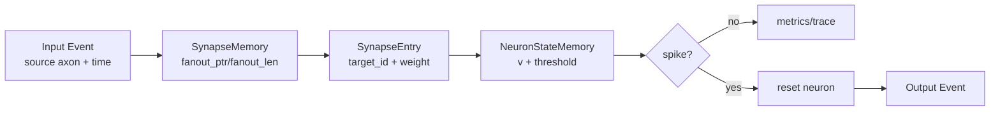

# Mini-Loihi

Mini-Loihi is a small, deterministic Python architecture simulator inspired by
Loihi-style event-driven neuromorphic execution. It is **Mini-Loihi-like**, not a
Loihi reproduction: the project models a compact set of architectural ideas
without claiming binary, timing, routing, energy, or learning-rule compatibility
with Intel Loihi hardware.

The simulator is intended for code study, technical presentations, research
discussion, and future hardware-design exploration.

## Features

- Single-core event-driven fixed-weight propagation.
- Time-aware events and deterministic FIFO/heap scheduling.
- Integer neuron state, int8 weights, int16 voltage updates, and saturation.
- Reward-modulated three-factor plasticity with eligibility traces.
- Deterministic two-class temporal-pattern learning task.
- Stability presets and guardrails for saturation, silence, collapse, and spike
  explosion.
- Synthetic scale benchmarks, memory estimates, and profiling.
- Multi-core packet routing with deterministic tie-breaking and exact multicast.
- Global graph partitioning, capacity checks, and mapping round-trip validation.
- Module CLI, JSON/CSV export, reference results, and consolidated documentation.

## Install And Test

The project has no runtime dependencies beyond Python. Tests use `pytest`.

On this Windows workspace, prefer the venv interpreter and module entry points:

```powershell
.\personal-intel-agent\.venv\Scripts\python.exe -m pytest
.\personal-intel-agent\.venv\Scripts\python.exe -m mini_loihi pattern-learning
```

If the Windows launcher fails because the workspace path contains non-ASCII
characters, the package entry point can still be exercised through pytest tests;
do not assume `python` or `git` is globally on `PATH`.

## Quick Start

```powershell
.\personal-intel-agent\.venv\Scripts\python.exe -m mini_loihi toy
.\personal-intel-agent\.venv\Scripts\python.exe -m mini_loihi plasticity
.\personal-intel-agent\.venv\Scripts\python.exe -m mini_loihi pattern-learning --preset stable --json
.\personal-intel-agent\.venv\Scripts\python.exe -m mini_loihi benchmark --csv benchmark.csv
.\personal-intel-agent\.venv\Scripts\python.exe -m mini_loihi multicore-demo
.\personal-intel-agent\.venv\Scripts\python.exe -m mini_loihi mapping-report --json
.\personal-intel-agent\.venv\Scripts\python.exe -m mini_loihi validation
.\personal-intel-agent\.venv\Scripts\python.exe -m mini_loihi reference-results --output docs/reference_results.local.json
```

## Architecture Overview

Single-core processing consumes an `Event(source_id, time)`, reads the source
fanout from CSR-like synapse memory, updates target neuron state, resets on
spike, and emits output events. Learning is disabled by default.



## Three-Factor Learning

Plastic synapses hold weight, pre trace, post trace, eligibility, and a plastic
flag. Local event processing updates traces and eligibility. A later explicit
reward applies `delta_w = learning_rate * reward * eligibility`, then clamps the
weight to int8 range. This is a minimal deterministic rule, not a biological
model or a Loihi-compatible learning engine.

## Pattern Learning Example

The default stable preset trains a tiny deterministic two-class temporal task.
Pattern A maps to output 0, pattern B maps to output 1.

Representative reference result:

- pre-training accuracy: `0.50`
- post-training accuracy: `1.00`
- stability label: `stable_learning`
- expected clamped update count: `0`

## Benchmark Example

Benchmarks report measured Python host runtime plus analytical memory estimates.
They are not hardware throughput or energy measurements.

```powershell
.\personal-intel-agent\.venv\Scripts\python.exe -m mini_loihi benchmark --json
.\personal-intel-agent\.venv\Scripts\python.exe -m mini_loihi multicore-benchmark --csv multicore.csv
```

## Multi-Core Routing Example

The multi-core layer adds `EventPacket`, `RoutingEntry`, `RoutingTable`, and
`MultiCoreSystem`. Remote synaptic state is destination-owned: a sender emits a
packet; the receiving core owns the synapse, eligibility, and reward update.

## Hardware Mapping Example

Mapping utilities partition a global graph into local neuron IDs, local axons,
synapse memories, and routing entries. Capacity checks are abstract estimates,
not RTL resource usage.

## Repository Structure

```text
mini_loihi/
  core.py                  single-core event execution
  memory.py                neuron and synapse memory models
  event.py                 Event and EventQueue
  pattern_task.py          deterministic V2 learning task
  stability_audit.py       diagnostics and stability labels
  benchmark.py             single-core synthetic benchmarks
  multicore.py             multi-core routing and scheduler
  multicore_benchmark.py   multi-core benchmark scenarios
  mapping.py               partitioning and capacity reports
  validation.py            equivalence and determinism witnesses
  presets.py               named reproducible presets
  __main__.py              module CLI
tests/
docs/
examples/
```

## Public API

The intended public API is exported from `mini_loihi.__init__`: `CoreConfig`,
`Event`, `MiniLoihiCore`, `MultiCoreSystem`, `GlobalNeuronRef`, `LocalAxonRef`,
`EventPacket`, `RoutingEntry`, `RoutingTable`, pattern-task builders, stability
audit helpers, benchmark helpers, mapping helpers, validation helpers, presets,
and export helpers.

## Limitations

Mini-Loihi uses simplified IF/LIF-like dynamics, integer trace decay, a central
deterministic scheduler, single-process multi-core simulation, Python object
storage, analytical memory estimates, toy learning tasks, and CPU runtime
measurements. It has no physical mesh NoC, cycle-accurate timing, RTL, real
hardware energy model, external datasets, or exact Loihi compatibility.

## Development History

V0 established fixed-weight single-core propagation. V1 added time-aware
plasticity. V2 added a trainable temporal task and stability presets. V3 added
scale benchmarks, profiling, and memory modeling. V4 added multi-core routing
and mapping. V4.1/V4.1b added architecture validation and measured multi-core
evidence. V5 packages the validated simulator as a reproducible engineering and
research artifact.

Future work should remain evidence-driven: larger workloads, richer learning
rules, hardware-oriented data layouts, or RTL experiments should be added only
after the current semantics stay locked down by tests.
