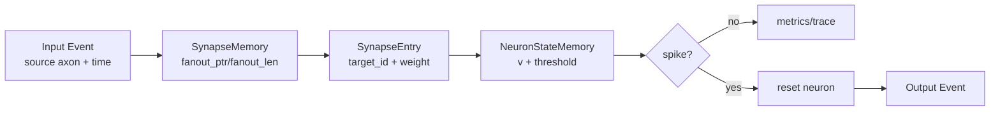

# Mini-Loihi

V7.1B1 adds the separately versioned `mini_loihi_v7_1b_mempipe` executable RTL profile with instance-local compile-time image loading, synchronous ROM/RAM access, sequential state initialization, and an ascending touched-neuron scanner. See [docs/V7_1B1_MEMORY_AND_INITIALIZATION.md](docs/V7_1B1_MEMORY_AND_INITIALIZATION.md).

```powershell
C:\venvs\mini_loihi\Scripts\python.exe -m mini_loihi rtl-mempipe-export-demo --output-dir build/mempipe
C:\venvs\mini_loihi\Scripts\python.exe -m mini_loihi rtl-mempipe-verify-demo
C:\venvs\mini_loihi\Scripts\python.exe -m mini_loihi rtl-mempipe-regression --seeds 100
C:\venvs\mini_loihi\Scripts\python.exe -m mini_loihi rtl-mempipe-trace --output build/mempipe-trace.jsonl
```

Mini-Loihi is a small, deterministic Python architecture simulator inspired by
Loihi-style event-driven neuromorphic execution. It is **Mini-Loihi-like**, not a
Loihi reproduction: the project models a compact set of architectural ideas
without claiming binary, timing, routing, energy, or learning-rule compatibility
with Intel Loihi hardware.

The simulator is intended for code study, technical presentations, research
discussion, and future hardware-design exploration.

## Features

- Single-core event-driven fixed-weight propagation.
- Time-aware events and deterministic FIFO/heap scheduling.
- Integer neuron state, int8 weights, int16 voltage updates, and saturation.
- Reward-modulated three-factor plasticity with eligibility traces.
- Deterministic two-class temporal-pattern learning task.
- Stability presets and guardrails for saturation, silence, collapse, and spike
  explosion.
- Synthetic scale benchmarks, memory estimates, and profiling.
- Multi-core packet routing with deterministic tie-breaking and exact multicast.
- Global graph partitioning, capacity checks, and mapping round-trip validation.
- Module CLI, JSON/CSV export, reference results, and consolidated documentation.
- V6 typed architecture contract, LIF/ALIF Model IR, deterministic compiler, and
  BRAM-oriented hardware images.
- V6.1 bit-exact compiled-program execution, fixed-width arithmetic, canonical
  traces, and restricted V5 differential validation.
- V6.2 deterministic hardware-cycle execution with bounded FIFOs, pipelines,
  priority round-robin arbitration, backpressure, traces, and timing reports.
- V7.0 synthesizable single-core LIF SystemVerilog with generated contracts,
  Icarus simulation, and V6.1/V6.2 differential verification.
- V7.1A verification-truth audit, explicit-tick golden execution, hardened RTL
  contracts, storage inventory, and optional lint/synthesis gates.

## Install And Test

The project has no runtime dependencies beyond Python. Tests use `pytest`.

On this Windows workspace, prefer the venv interpreter and module entry points:

```powershell
C:\venvs\mini_loihi\Scripts\python.exe -m pytest
C:\venvs\mini_loihi\Scripts\python.exe -m mini_loihi pattern-learning
```

## Quick Start

```powershell
C:\venvs\mini_loihi\Scripts\python.exe -m mini_loihi toy
C:\venvs\mini_loihi\Scripts\python.exe -m mini_loihi plasticity
C:\venvs\mini_loihi\Scripts\python.exe -m mini_loihi pattern-learning --preset stable --json
C:\venvs\mini_loihi\Scripts\python.exe -m mini_loihi architecture-report --json
C:\venvs\mini_loihi\Scripts\python.exe -m mini_loihi compile-demo --output-dir build\v6_demo
C:\venvs\mini_loihi\Scripts\python.exe -m mini_loihi execute-demo --json
C:\venvs\mini_loihi\Scripts\python.exe -m mini_loihi reference-trace --output build\reference_trace.jsonl
C:\venvs\mini_loihi\Scripts\python.exe -m mini_loihi cycle-demo --json
C:\venvs\mini_loihi\Scripts\python.exe -m mini_loihi timing-report --json
C:\venvs\mini_loihi\Scripts\python.exe -m mini_loihi cycle-trace --output build\cycle_trace.jsonl
C:\venvs\mini_loihi\Scripts\python.exe -m mini_loihi rtl-verify-demo
C:\venvs\mini_loihi\Scripts\python.exe -m mini_loihi rtl-regression --seeds 20
C:\venvs\mini_loihi\Scripts\python.exe -m mini_loihi rtl-audit
C:\venvs\mini_loihi\Scripts\python.exe -m mini_loihi rtl-storage-report --json
C:\venvs\mini_loihi\Scripts\python.exe -m mini_loihi rtl-gate --full --seeds 100
```

## Architecture Overview

Single-core processing consumes an `Event(source_id, time)`, reads the source
fanout from CSR-like synapse memory, updates target neuron state, resets on
spike, and emits output events. Learning is disabled by default.



## Three-Factor Learning

Plastic synapses hold weight, pre trace, post trace, eligibility, and a plastic
flag. Local event processing updates traces and eligibility. A later explicit
reward applies `delta_w = learning_rate * reward * eligibility`, then clamps the
weight to int8 range. This is a minimal deterministic rule, not a biological
model or a Loihi-compatible learning engine.

## Pattern Learning Example

The default stable preset trains a tiny deterministic two-class temporal task.
Pattern A maps to output 0, pattern B maps to output 1.

Representative reference result:

- pre-training accuracy: `0.50`
- post-training accuracy: `1.00`
- stability label: `stable_learning`
- expected clamped update count: `0`

## Benchmark Example

Benchmarks report measured Python host runtime plus analytical memory estimates.
They are not hardware throughput or energy measurements.

```powershell
C:\venvs\mini_loihi\Scripts\python.exe -m mini_loihi benchmark --json
C:\venvs\mini_loihi\Scripts\python.exe -m mini_loihi multicore-benchmark --csv multicore.csv
```

## Multi-Core Routing Example

The multi-core layer adds `EventPacket`, `RoutingEntry`, `RoutingTable`, and
`MultiCoreSystem`. Remote synaptic state is destination-owned: a sender emits a
packet; the receiving core owns the synapse, eligibility, and reward update.

## Hardware Mapping Example

Mapping utilities partition a global graph into local neuron IDs, local axons,
synapse memories, and routing entries. Capacity checks are abstract estimates,
not RTL resource usage.

## Repository Structure

```text
mini_loihi/
  core.py                  single-core event execution
  memory.py                neuron and synapse memory models
  event.py                 Event and EventQueue
  pattern_task.py          deterministic V2 learning task
  stability_audit.py       diagnostics and stability labels
  benchmark.py             single-core synthetic benchmarks
  multicore.py             multi-core routing and scheduler
  multicore_benchmark.py   multi-core benchmark scenarios
  mapping.py               partitioning and capacity reports
  validation.py            equivalence and determinism witnesses
  presets.py               named reproducible presets
  architecture.py          V6 target formats, packet, capacities, and semantics
  model_ir.py              typed LIF/ALIF network description
  hardware_ir.py           immutable compiled integer images
  compiler.py              deterministic placement and lowering
  artifacts.py             canonical JSON and hexadecimal memory images
  fixed_point.py           centralized fixed-width integer arithmetic
  reference_state.py       mutable V6.1 machine state and typed results
  reference_backend.py     compiled-program tick execution engine
  reference_trace.py       deterministic golden JSONL tracing
  reference_compatibility.py restricted V5/V6 differential validation
  microarchitecture.py     immutable V6.2 resource and latency preset
  cycle_state.py           typed registered queues, pipelines, and results
  cycle_backend.py         independent synchronous cycle execution engine
  cycle_trace.py           canonical hardware-cycle JSONL tracing
  timing_report.py         utilization, stalls, and timing-budget reports
  rtl_config.py            frozen V7.0 supported RTL profile
  rtl_artifacts.py         deterministic SV and memory export
  rtl_verify.py            Icarus differential verification
  rtl_audit.py             latency, storage, lint, synthesis, and gate evidence
  lifpipe_config.py        frozen V7.1B2 six-stage physical pipeline profile
  lifpipe_artifacts.py     deterministic B2 production image export
  lifpipe_cycle.py         independent B2 valid/ready cycle oracle
  lifpipe_trace.py         physical stage trace schema and parser
  lifpipe_verify.py        B2 Icarus functional/cycle differential verification
  __main__.py              module CLI
rtl/                       synthesizable V7.0 core and testbenches
tests/
docs/
examples/
```

## Public API

The intended public API is exported from `mini_loihi.__init__`: `CoreConfig`,
`Event`, `MiniLoihiCore`, `MultiCoreSystem`, `GlobalNeuronRef`, `LocalAxonRef`,
`EventPacket`, `RoutingEntry`, `RoutingTable`, pattern-task builders, stability
audit helpers, benchmark helpers, mapping helpers, validation helpers, presets,
and export helpers.

## Limitations

Mini-Loihi uses simplified IF/LIF-like dynamics, integer trace decay, a central
deterministic scheduler, single-process multi-core simulation, Python object
storage, analytical memory estimates, toy learning tasks, and CPU runtime
measurements. V7.0 adds a restricted single-core LIF RTL kernel, but has no physical
mesh NoC, real hardware energy model, external datasets, proven worst-case
latency bound, or exact Loihi compatibility.

## Development History

V0 established fixed-weight single-core propagation. V1 added time-aware
plasticity. V2 added a trainable temporal task and stability presets. V3 added
scale benchmarks, profiling, and memory modeling. V4 added multi-core routing
and mapping. V4.1/V4.1b added architecture validation and measured multi-core
evidence. V5 packages the validated simulator as a reproducible engineering and
research artifact. V6.0 adds the typed architecture contract, Model IR, compiled
Hardware IR, and deterministic artifacts needed before bit-exact or RTL work.
V6.1 executes the compiled image as an integer-exact functional oracle and emits
canonical traces for differential verification. V6.2 independently executes the
same image with finite hardware resources while preserving V6.1 logical results.
V7.0 crosses into synthesizable SystemVerilog for the fixed, zero-delay,
single-core LIF subset and verifies it against both software oracles.
V7.1B1 moves the image into instance-local synchronous memories with sequential
initialization. V7.1B2 adds a separately versioned six-stage registered,
backpressure-capable LIF pipeline with atomic spike/writeback commit and its own
cycle oracle; V7.0 and B1 behavior remain frozen.
V7.1C validates those frozen production tops with OSS CAD lint, structural and
generic synthesis reports, bounded formal smoke checks, and a dense workload
that demonstrates one-neuron-per-cycle B2 steady-state throughput.

Future work should remain evidence-driven: larger workloads, richer learning
rules, hardware-oriented data layouts, or RTL experiments should be added only
after the current semantics stay locked down by tests.
