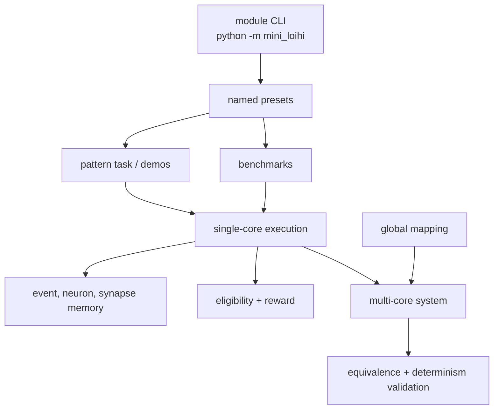

# Architecture

Mini-Loihi is organized around a small set of explicit state containers and
deterministic execution loops. The code is an architecture simulator, not a
machine-learning framework and not a Loihi compatibility layer.

## Module Boundaries

- `event.py`: `Event` and FIFO event queues for single-core work.
- `numeric.py`: int8/int16 validation and saturating arithmetic.
- `memory.py`: CSR-like synapse memory and neuron-state memory.
- `core.py`: single-core event execution, traces, metrics, and reward updates.
- `pattern_task.py`: deterministic V2 temporal-pattern task.
- `stability_audit.py`: diagnostics, guardrails, and stability labels.
- `benchmark.py`: synthetic single-core workloads, memory estimates, profiling.
- `multicore.py`: packet routing, scheduler, traffic metrics, profiling buckets.
- `mapping.py`: global graph partitioning, local axons, capacity reports.
- `validation.py`: equivalence and determinism witnesses.
- `presets.py`: named reproducible experiment presets.
- `__main__.py`: `python -m mini_loihi` CLI.

## Public API

The stable public surface is exported from `mini_loihi.__init__`: `CoreConfig`,
`Event`, `MiniLoihiCore`, `SynapseMemory`, `NeuronStateMemory`,
`MultiCoreSystem`, `GlobalNeuronRef`, `LocalAxonRef`, `EventPacket`,
`RoutingEntry`, `RoutingTable`, pattern-task builders, stability audit helpers,
benchmark helpers, mapping helpers, validation helpers, presets, and export
helpers.

Implementation details may still be imported directly for code study, but new
examples and docs should prefer the public package exports.

## System Stack

