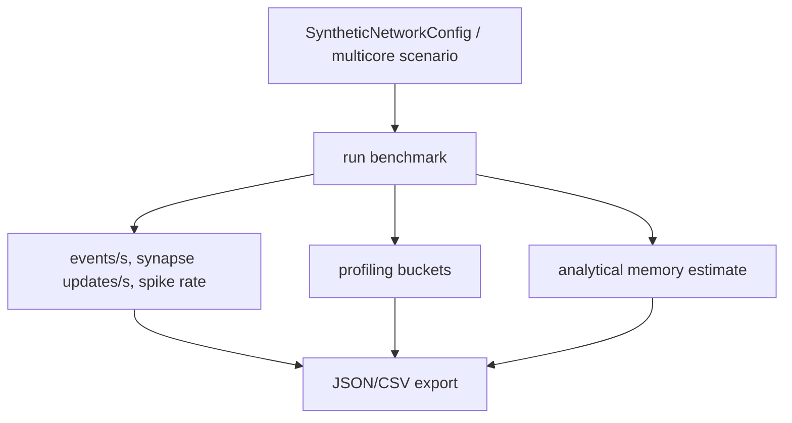

# Benchmarking

Benchmarks are measured Python host runtime plus analytical memory estimates.
They are not hardware-performance claims.

Single-core benchmarks include synthetic 256, 1k, and 4k neuron networks and a
fixed-versus-plastic overhead comparison. Multi-core benchmarks include
feedforward, mostly-local, communication-heavy, multicast-heavy, guarded
recurrent, and plastic two-core scenarios.

Some workloads suppress spike cascades for stable scaling measurements. Others
encourage communication or recurrent activity to exercise routing and guards.

