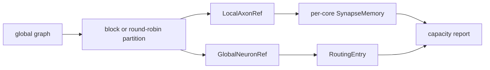

# Hardware Mapping

Mapping utilities translate a global graph into per-core local neuron IDs,
local axons, synapse memories, and routing entries.

Capacity checks are abstract engineering constraints. They estimate neurons,
axons, synapses, routing entries, and memory bytes; they are not FPGA/ASIC area
or timing closure results.

