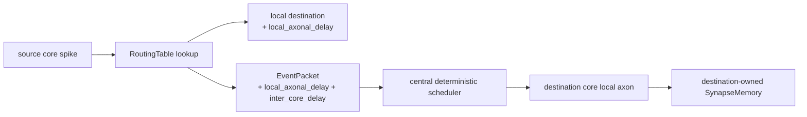
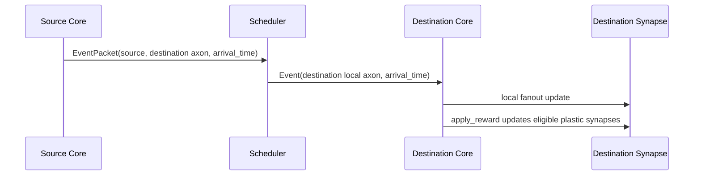

# Multi-Core Architecture

The V4/V5 multi-core layer is a system wrapper around existing single-core
execution. It does not replace `MiniLoihiCore` and does not add a physical NoC.

## Concepts

- `GlobalNeuronRef`: `(core_id, local_neuron_id)` source identity.
- `LocalAxonRef`: `(core_id, local_axon_id)` destination axon identity.
- `RoutingEntry`: local and remote destinations for a source neuron.
- `EventPacket`: remote spike packet with emission and arrival time.
- `MultiCoreSystem`: deterministic scheduler, routing, packet delivery, metrics,
  and profiling buckets.

## Packet Flow

## Destination-Owned Plasticity

A remote source never mutates a destination synapse directly. Packet arrival is
converted into a local event on the destination core. The destination core owns
the target synapse, traces, eligibility, reward response, and clamping.

## Determinism

The scheduler orders work by arrival time, destination core ID, destination
local axon ID, and insertion sequence. This is deterministic and testable, but
it is not a cycle-accurate hardware arbitration model.

## Profiling

Profiling buckets include scheduler, routing lookup, multicast expansion, packet
construction, priority queue operations, local delivery, core processing, reward
application, and metrics collection. These are Python runtime measurements only.
