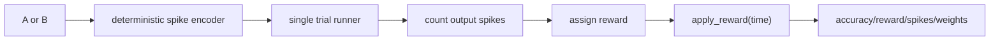

# Pattern Task

The V2 task is a tiny deterministic temporal classification problem used before
larger datasets.

- Pattern A emits one input spike and targets output neuron 0.
- Pattern B emits two timed input spikes and targets output neuron 1.
- Correct output receives positive reward.
- Wrong output receives negative reward.
- No clear output receives the configured no-output reward.

The task is intentionally small so eligibility traces, reward timing, and
stability failure modes are easy to inspect.

