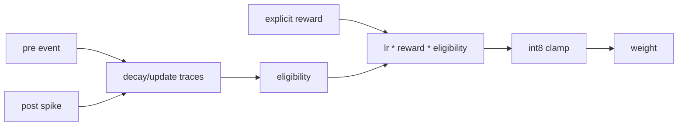

# Plasticity

Learning is disabled by default. When `CoreConfig.learning_enabled=True`, only
synapses with `plastic=True` can update.

Each plastic synapse preserves fixed inference fields:

- `target_id`
- int8 `weight`

and adds plasticity state:

- `pre_trace`
- `post_trace`
- `eligibility`
- `plastic`

Trace decay is linear integer decay as a function of elapsed event time. It is a
clear deterministic model, not a biological exponential trace and not a Loihi
microcode implementation.

