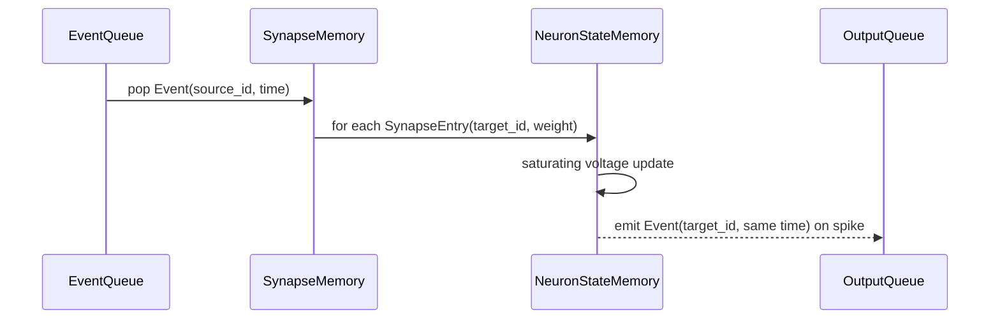

# Single-Core Execution

A single input event names a source axon/neuron ID and a time. The core reads the
source fanout, applies each synaptic weight to the target neuron's voltage with
int16 saturation, resets on spike, and emits output events.

Axon IDs index fanout lists. Neuron IDs index target state. V0 compatibility
keeps a default `num_neurons = 256` and `num_axons = num_neurons` unless a
configuration overrides them.

