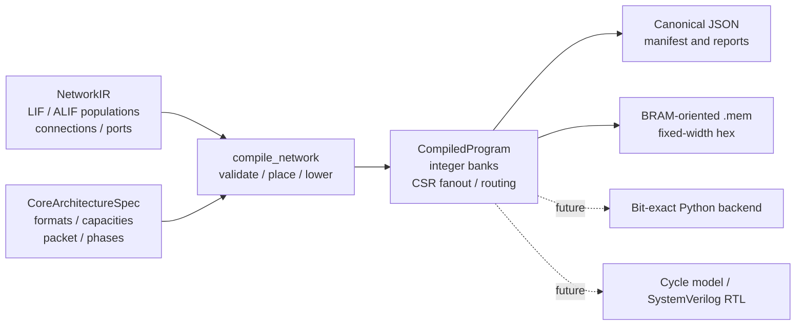

# Mini-Loihi V6.0 Architecture Contract and Hardware IR

## Purpose

V6.0 adds a stable software-to-hardware boundary to the validated V5 simulator.
V5 runtime objects are useful behavioral models, but they are not a hardware ABI:
`MiniLoihiCore`, `NeuronStateMemory`, and `SynapseEntry` contain Python behavior,
mutable state, and debugging data that cannot be loaded directly into BRAM.

The V6 boundary has four deliberately separate layers:

1. `model_ir.py` describes the mathematical network and typed neuron parameters.
2. `architecture.py` describes target limits, number formats, packets, and execution semantics.
3. `hardware_ir.py` contains immutable compiled integer arrays and resource reports.
4. `artifacts.py` serializes those arrays into canonical JSON and fixed-width hexadecimal memory files.



## Baseline Architecture

The named preset is `mini_loihi_v6_ref`, version `6.0`. It explicitly defines:

- 256 neurons, 256 destination axons, and 4096 synapses per core;
- 1024 outbound routing entries per core;
- input and output FIFO depths of 256;
- signed 8-bit weights, signed 16-bit neuron/threshold/adaptation/learning state;
- a signed 24-bit synaptic accumulator;
- a signed 40-bit order-invariant synaptic sum intermediate;
- a signed 32-bit elapsed-decay product intermediate;
- saturating overflow and truncate rounding;
- a 64-bit event packet; and
- LIF model ID 0 and ALIF model ID 1.

Numeric values in a compiled image are integers. Signed `.mem` values use fixed-width
two's-complement hexadecimal. There is no implicit dependence on Python's unbounded
integer behavior. Fractional bits are zero in the reference preset, but the format
contract records them for a future fixed-point backend.

## Tick Semantics

The architecture contract uses integer ticks. For all events at tick `t`, the
same-tick policy is `batch_accumulate_then_update` and each neuron updates at most
once. The exact phase order is:

1. ingress;
2. synaptic accumulation;
3. neuron update;
4. spike emission;
5. learning; and
6. routing.

Ordering within a deterministic phase is timestamp, destination core, destination
axon, source core, source neuron, then connection ID. Microstep execution is
disabled. Zero-delay recurrent edges are nevertheless legal because routing has an
inherent transport latency of one logical tick.

V6.1 resolves the routed zero-delay boundary explicitly. An axon event already
present at ingress tick `t` may traverse a delay-zero synapse and contribute during
tick `t`. A spike created during tick `t` does not exist until spike emission, after
the accumulation and update phases. Routing therefore assigns every newly emitted
packet arrival tick `t + 1`. A delay-zero synapse reached by that packet contributes
at `t + 1`; it never creates a same-tick microstep. More generally:

```text
routed_contribution_tick = spike_emission_tick + 1 + synaptic_delay
```

Consequently delay-zero self-loops and recurrent loops are legal and each traversal
advances by at least one logical tick. Negative synaptic delay remains invalid.

This specification is a contract for future V6 backends. The existing V5 event
runtime retains its validated FIFO/heap processing behavior and is not silently
changed by V6.0.

## Packet Format

The reference packet is 64 bits. Fields consume 58 bits:

| Field | Bits |
| --- | ---: |
| event type | 3 |
| source core | 6 |
| source neuron | 8 |
| destination core | 6 |
| destination axon | 8 |
| timestamp | 16 |
| payload | 8 |
| priority | 3 |
| reserved | 6 |

The compiler validates core, neuron, axon, delay, and payload-related values against
their declared formats. `routing.mem` uses the architecture packet width and packs
source core, source neuron, destination core, and destination axon into the low-order
28 bits; the upper bits are zero in V6.0.

## Memory Ownership and Layout

Synaptic memory is destination-owned. A source neuron has one routing entry for each
destination-core axon that represents it. The destination axon indexes CSR-like
`axon_ptr` and `axon_len`; the resulting interval addresses parallel target, weight,
delay, learning-rule, and learning-tag arrays.

Within a core, neurons are ordered by local neuron ID. Axons are ordered by stable
source `(population_id, population_index)`. Synapses within an axon are ordered by
target population, target index, delay, and connection ID. Connections with equal
endpoints remain separate entries, so multiplicity is preserved.

Each `core_NNN` artifact directory contains:

- `neuron_model.mem`;
- `neuron_threshold.mem`, `neuron_reset.mem`, `neuron_leak.mem`;
- `neuron_adaptation_increment.mem`, `neuron_adaptation_decay.mem`;
- `neuron_state_voltage.mem`, `neuron_state_adaptation.mem`;
- `axon_ptr.mem`, `axon_len.mem`;
- `synapse_target.mem`, `synapse_weight.mem`, `synapse_delay.mem`;
- `synapse_rule.mem`, `synapse_tag.mem`; and
- `routing.mem`.

At the root, `manifest.json`, `architecture.json`, `normalized_model.json`, and
`compilation_report.json` describe the build. Files use ASCII, uppercase hexadecimal,
LF newlines, canonical ordering, and no timestamps. The SHA-256 build fingerprint is
calculated from normalized semantic input and compiled content.

## Placement

`compile_network` supports deterministic `block` and `round_robin` placement. Both
first order populations by ID and neurons by local index. Block placement assigns
contiguous balanced blocks; round-robin placement assigns global ordered neurons by
`index % num_cores`. The interface leaves room for a future cost-based strategy, but
V6.0 performs no graph optimization.

## Worked Lowering Example

Consider two LIF source neurons and two ALIF target neurons on two cores:

```text
c1: source[0] -> target[0], weight 5, delay 1
c2: source[0] -> target[0], weight 7, delay 1
c3: source[1] -> target[1], weight -2, delay 2
```

Block placement puts both source neurons on core 0 and both targets on core 1.
Core 1 allocates axon 0 for `source[0]` and axon 1 for `source[1]`:

```text
axon_ptr       = [0, 2]
axon_len       = [2, 1]
synapse_target = [0, 0, 1]
synapse_weight = [5, 7, -2]
synapse_delay  = [1, 1, 2]
```

Core 0 owns two outbound routes: `(core0, neuron0) -> (core1, axon0)` and
`(core0, neuron1) -> (core1, axon1)`. The duplicate endpoint is represented by two
synapse entries, not two redundant routes.

## Backend Boundaries

- A future NIR adapter may translate a supported NIR subset into `NetworkIR`; NIR is
  not a V6.0 dependency and does not define the hardware ABI.
- A future bit-exact Python backend should execute `CompiledProgram` using only the
  declared numeric formats and tick phases.
- The V6.2 cycle model adds FIFO occupancy, arbitration, and cycle costs while
  preserving V6.1 architectural results.
- Future SystemVerilog should consume the same memory images and validate against the
  bit-exact backend. V6.0 contains no RTL and makes no timing or resource claim.

## Non-Goals and Limitations

V6.0 does not add RTL, a generic neuron microcode ISA, Izhikevich neurons, NIR,
graph-partition optimization, cycle accuracy, physical NoC behavior, or Loihi binary
compatibility. It does not execute `CompiledProgram` and does not change V5 learning
or event semantics. FIFO depth and packet layout are validated architecture fields,
not measured hardware implementations.
