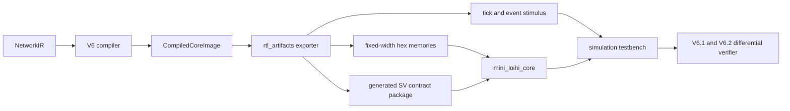
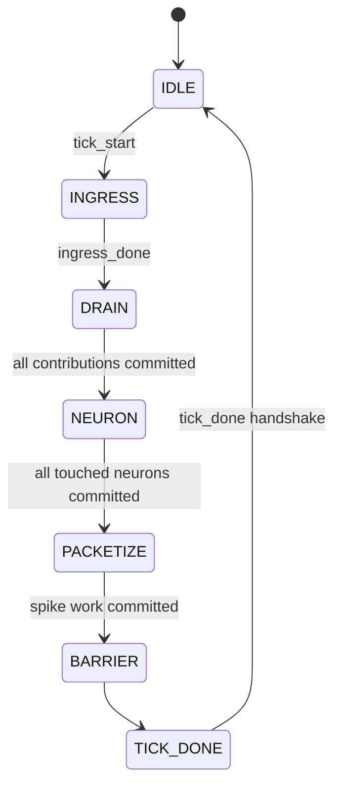

# Mini-Loihi V7.0 RTL Kernel

> V7.0 is frozen. V7.1B1 adds a separate synchronous-storage profile without changing this RTL or its canonical trace. See `V7_1B1_MEMORY_AND_INITIALIZATION.md`.

## Scope

V7.0 is a synthesizable, single-core, fixed-synapse LIF kernel. It consumes a
deterministic `CompiledCoreImage`; it does not execute `NetworkIR`. The accepted
profile is `mini_loihi_v6_ref` plus the common single-core timing resources from
`mini_loihi_v6_2_ref`: model ID 0, integer formats, delay zero, no learning or
learning tags, and no image that requires spike-triggered packet routing.

ALIF, online learning, non-zero synaptic delay, multicore routing, a physical
NoC, AXI, vendor primitives, board support, and a neuron microcode ISA remain
unsupported. Export rejects these features rather than reinterpreting them.

## Artifact Path



The generated package contains capacities, active image sizes, widths,
signedness policy, FIFO depths, lane counts, latencies, and overflow policy. Its
text is canonical, has no timestamp, includes the source-contract SHA-256, and
is byte-compared with the checked-in package to detect drift.

## RTL Hierarchy

`mini_loihi_core.sv` owns the controller, CSR work queues, touched-neuron state,
signed 40-bit accumulator bank, memories, and output interface. It instantiates
two `synapse_lane` datapaths, one `lif_neuron_datapath`, an ingress `rv_fifo`, and
a spike `rv_fifo`. Memory loading and line-oriented tracing live in
`tb_mini_loihi_core.sv`; assertions are guarded by `ifndef SYNTHESIS`.

## Host Protocol And FSM

The host handshakes `tick_start`, sends zero or more events, then handshakes
`ingress_done`. A temporary empty ingress FIFO is not an end-of-tick signal.
`tick_done` is held until accepted, after synaptic work, accumulator writes,
neuron writeback, and spike enqueue are quiescent. Ready/valid backpressure is
supported at ingress, spike output, and tick completion.



Cycle zero is the first rising edge after the `tick_start` handshake commits.
Reset, `$readmemh`, and testbench setup cycles are excluded. An explicit empty
tick takes five aligned core cycles in the directed fixture.

## CSR, Arbitration, And Accumulation

An accepted event enters the depth-8 FIFO. The one-cycle axon lookup creates a
fanout work item. Two lanes issue consecutive addresses in compiled CSR order.
Contributions become eligible two cycles after issue. The single accumulator
port selects the same deterministic V6.2 key: target neuron, then event ID, then
synapse address. A loser remains pending; duplicate connections are preserved.

Each touched neuron has a signed 40-bit accumulator for the active tick. The
bank uses touched bits, cleared sequentially after neuron writeback, so there is
no combinational full-bank clear and no stale value crosses a tick boundary.
The 40-bit value narrows exactly once to signed 24 bits at neuron issue.

Per-contribution 24-bit saturation is invalid. For example, same-tick values
`+9_000_000` and `-9_000_000` have a 40-bit sum of zero. Saturating the first
value to `8_388_607` before adding the second produces a different, order-
dependent answer. V7 keeps both in 40 bits and narrows the final zero.

## Widths And Arithmetic

| Value | Format |
| --- | --- |
| Weight | signed 8-bit |
| Payload | unsigned 8-bit |
| Weight times payload | signed 16-bit |
| Same-tick running sum | signed 40-bit |
| Narrowed accumulator | signed 24-bit |
| Membrane, threshold, reset, leak | signed 16-bit |
| Leak times elapsed | signed 32-bit |
| Tick | unsigned 16-bit |
| Neuron and axon IDs | unsigned 8-bit |
| Synapse address | unsigned 12-bit |
| CSR pointer/length | unsigned 13-bit |

Mixed-width boundaries use explicit signed casts. As a worked example, weight
`-3` (`8'hFD`) times payload `2` (`8'h02`) sign-extends to the signed 16-bit
contribution `-6` (`16'hFFFA`). Saturating narrow maps a 40-bit value above
`8_388_607` to signed 24-bit `8_388_607`.

The LIF lane computes:

```text
elapsed = tick - last_update_tick
v_decay = move_toward_zero(v_old, leak * elapsed)
accumulator_24 = saturating_narrow_40_to_24(wide_sum)
v_candidate = saturating_narrow_to_16(v_decay + accumulator_24)
spike = v_candidate >= threshold
v_next = reset_voltage if spike else v_candidate
```

Only touched neurons update, in ascending neuron order, through one lane. A
spike-producing writeback waits if the depth-4 spike FIFO cannot accept it.

## Deterministic Demo

The demo has source axon 0 connected to neuron 1 with weight `+5` and neuron 2
with weight `-3`. Tick 0 supplies two events; tick 3 supplies one.

| Tick | Milestone cycles |
| --- | --- |
| 0 | ingress 0,1; issue 3,4; accumulator writes 5,6,7,8; neuron issue 10,11; writeback 14,15; barrier 17; 18 total |
| 3 | same protocol with one event; 16 total |

The exact result is spike `(tick=0, core=0, neuron=1)`, membrane
`[0, 5, -6]`, last-update ticks `[0, 3, 3]`, and functional digest
`a36f7b85cbbe2f51a9fa330949bbe17bc7c600316bbcbe9a4cbc8b13395418c6`.

## Verification

```powershell
C:\venvs\mini_loihi\Scripts\python.exe -m mini_loihi rtl-export-demo --output-dir build\rtl
C:\venvs\mini_loihi\Scripts\python.exe -m mini_loihi rtl-verify-demo
C:\venvs\mini_loihi\Scripts\python.exe -m mini_loihi rtl-verify-demo --vcd build\rtl.vcd
C:\venvs\mini_loihi\Scripts\python.exe -m mini_loihi rtl-regression --seeds 20
```

The verifier compiles with Icarus `-g2012`, parses deterministic result and
trace records, checks V6.1 state/spikes/counters/digest, and checks the supported
V6.2 ingress, issue, accumulator, neuron, spike-enqueue, barrier, and total-cycle
milestones. Trace can be disabled without changing state or cycle results. Open
an optional VCD with `gtkwave build\rtl.vcd`; VCD generation is off by default.

Icarus is the required simulator. No frequency, timing, energy, or FPGA resource
claim is made. V7.1 should integrate a stronger open-source lint/synthesis gate
and decompose controller storage blocks while preserving this frozen trace.
