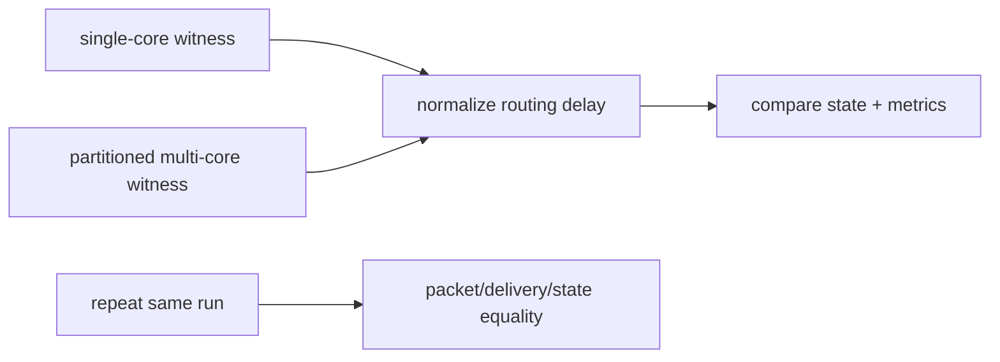

# Validation

Validation focuses on semantic invariants rather than broad performance.

- V0 fixed propagation remains locked down.
- Event time order and output timing are tested.
- Eligibility decay, delayed reward, and fixed-mode invariants are tested.
- Single-core and partitioned two-core executions are compared with delay
  normalization.
- Repeated multi-core runs produce identical packet order, delivery order,
  states, and metrics.
- Exact multicast delivers one packet per destination axon.
- Trace/metrics modes are observational and do not change final state.

